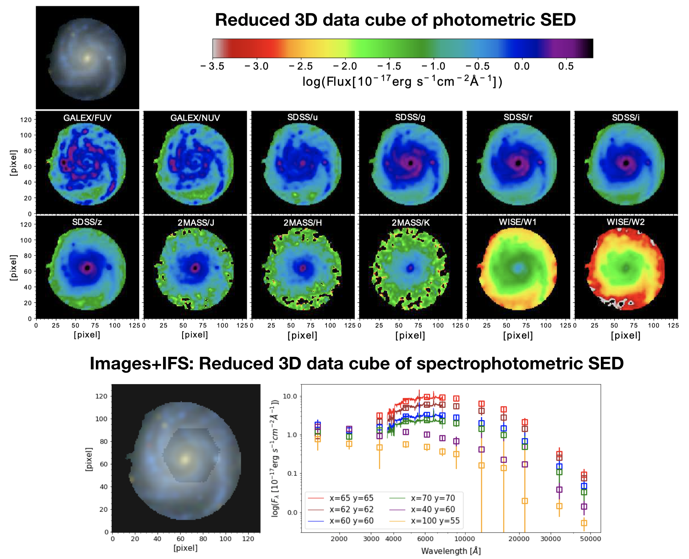
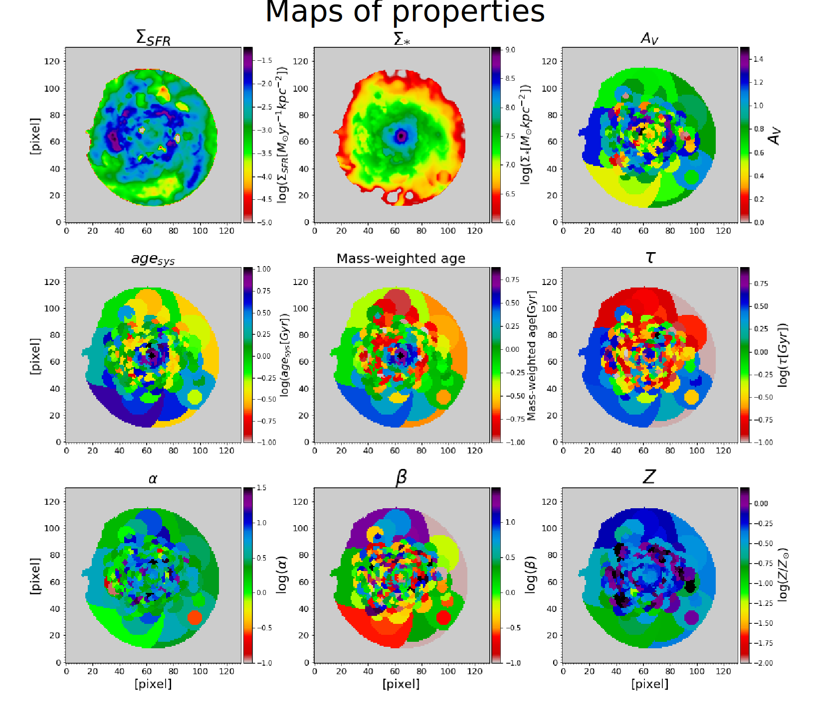

# piXedfit

[](https://github.com/aabdurrouf/piXedfit/blob/main/LICENSE.txt)
[](https://github.com/aabdurrouf/piXedfit/issues)
[](https://arxiv.org/abs/2101.09717)
[](https://github.com/aabdurrouf/piXedfit/stargazers)

**piXefit** provides a compehensive set of tools for analyzing spatially resolved spectral energy distributions (SEDs) of galaxies and dissecting the spatially resolved properties of the stellar populations and dust in the galaxies. First, it can produce a pixel-matched 3D data cube from an input of a set of mutliband imaging data alone or in combination with an integral field spectroscopy (IFS) data. When IFS data is provided, it can produce a 3D spectrophotometric data cube in which spectra and photometric SEDs are combined on pixel level. Second, it has a unique pixel binning feature that can optimize the S/N ratio of SEDs on spatially resolved scales while retaining the spatial and spectral variations of the SEDs by accounting the similarity of SED shape of pixels in the binning process. This can be expected to reduce biases introduced by the binning process that combines pixels regardless of the variations in their SED shapes. Finally, **piXedfit** also provides a stand-alone SED fitting capability. It has two options of fitting methods: MCMC and random dense sampling of parameter space (RDSPS). Most of the modules in **piXedfit** have implemented MPI for parallel computation. A detailed description of **piXedfit** is presented in [Abdurro'uf et al. (2021)](https://ui.adsabs.harvard.edu/abs/2021ApJS..254...15A/abstract). The documentation is given [here](https://pixedfit.readthedocs.io/en/latest/index.html). Some examples of practical usages and tutorials can be found at folder [examples](https://github.com/aabdurrouf/piXedfit/tree/main/examples).





## Features
**piXedfit** has six modules that work independently with each other. For instance, it is possible to use the SED fitting module for fitting either global (integrated) or spatially resolved SEDs of galaxies. Those modules include:

*  `piXedfit_images`: image processing.
*  `piXedfit_spectrophotometric`: spatial and spectral matching between multiband imaging data and IFS data.   
*  `piXedfit_bin`: pixel binning to optimize S/N of SEDs on spatially resolved scales.  
*  `piXedfit_model`: generating model SEDs.     
*  `piXedfit_fitting`: SED fitting on spatially resolved scales or global (integrated) scales.
*  `piXedfit_analysis`: Analysis of SED fitting result, including visualization plots and retrieving best-fitting parameters.   

## Installation
Please see [installation](https://pixedfit.readthedocs.io/en/latest/install.html) for dependencies and requirements. To install **piXedfit**, please follow the instruction below.

* cd to a desired installation directory, clone **piXedfit**, and install.
```
cd <install_dir>
git clone https://github.com/aabdurrouf/piXedfit.git
cd piXedfit
python -m pip install .
```
* Set an environmental variable called PIXEDFIT_HOME that point to **piXedfit** parent directory.
```
export PIXEDFIT_HOME="$PWD"
``` 
* The issue with the above command is that we need to do it every time we open a new terminal. Alternatively, we can add this environmental variable to .bashrc (add ```export PIXEDFIT_HOME="path_to_piXedfit"``` to the last line in the .bashrc file). 
```
vi ~/.bashrc
```
   Add the above line and then do
```
source  ~/.bashrc
```
* To add the environmental variable permanently, we can add the same line to ```~/.bash_profile``` or ```~/.profile``` and do ```source``` command.

The above instruction is for first installation, for upgrading **piXedfit**, please see [installation](https://pixedfit.readthedocs.io/en/latest/install.html).


## Convolution Kernels

Because of the large sizes of the kernel files, we do not upload them to this repository. We put the kernel files on this google drive [link](https://drive.google.com/drive/folders/1Fvl42e_LNWLYhKabDS1ew6wTQjeopcc6?usp=sharing). To be able to use image processing feature (`piXedfit_images`), you need to download the necessary kernel files and copy them to /data/kernels ($PIXEDFIT_HOME/data/kernels). List of the kernel files needed for image processing would depend on the imaging data that will be analyzed.


## Citation
If you use this code for your research, please reference [Abdurro'uf et al. (2021)](https://ui.adsabs.harvard.edu/abs/2021ApJS..254...15A/abstract):

```
@ARTICLE{2021ApJS..254...15A,
       author = {{Abdurro'uf} and {Lin}, Yen-Ting and {Wu}, Po-Feng and {Akiyama}, Masayuki},
        title = "{Introducing piXedfit: A Spectral Energy Distribution Fitting Code Designed for Resolved Sources}",
      journal = {\apjs},
     keywords = {Astronomical methods, Bayesian statistics, Galaxy evolution, Posterior distribution, 1043, 1900, 594, 1926, Astrophysics - Astrophysics of Galaxies},
         year = 2021,
        month = may,
       volume = {254},
       number = {1},
          eid = {15},
        pages = {15},
          doi = {10.3847/1538-4365/abebe2},
archivePrefix = {arXiv},
       eprint = {2101.09717},
 primaryClass = {astro-ph.GA},
       adsurl = {https://ui.adsabs.harvard.edu/abs/2021ApJS..254...15A},
      adsnote = {Provided by the SAO/NASA Astrophysics Data System}
}
``` 
   
If you use the pixel binning module (`piXedfit_bin`), please also reference [Abdurro'uf & Akiyama (2017)](https://ui.adsabs.harvard.edu/abs/2017MNRAS.469.2806A/abstract).


## Reference
A list of some projects **piXedfit** is benefitted from:
*  [Astropy](https://www.astropy.org/)
*  [Photutils](https://photutils.readthedocs.io/en/stable/)
*  [Aniano et al. (2011)](https://ui.adsabs.harvard.edu/abs/2011PASP..123.1218A/abstract) who provides convolution [kernels](https://www.astro.princeton.edu/~draine/Kernels.html)
*  [FSPS](https://github.com/cconroy20/fsps) and [Python-FSPS](http://dfm.io/python-fsps/current/) stellar population synthesis model
*  [emcee](https://emcee.readthedocs.io/en/stable/) package for the Affine Invariant Markov Chain Monte Carlo (MCMC) Ensemble sampler


