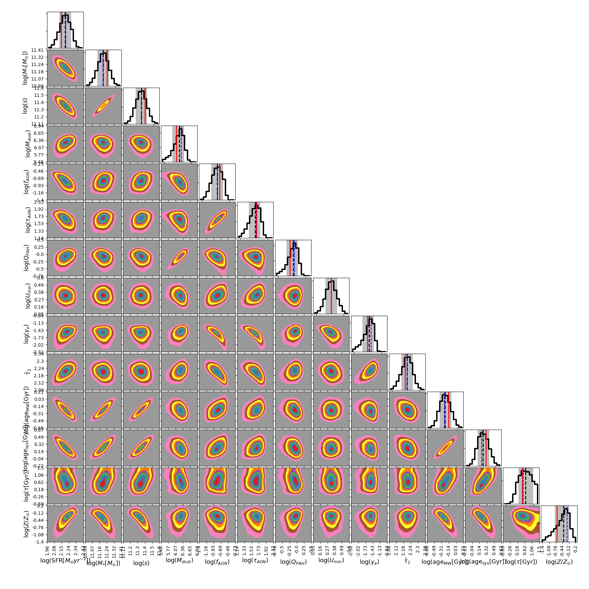

Demonstration of SED fitting
============================

Animation below shows a demonstration of the MCMC process in an SED fitting using the :mod:`piXedfit_fitting` module. For this example, SED fitting is done to a mock photometric SED covering GALEX/FUV to Herschel/SPIRE250.

If the animation doesn't run, please see the animation here.

.. figure:: animation_sed_sed42.gif
   :width: 400
   
.. figure:: animation_corner_posteriors_sed42.gif
   :width: 600

After each MCMC walker has done a certain number of steps, the MCMC process is terminated. Then we get the distributions of sampler chains, i.e., record of visited locations by the MCMC walkers in the N-dimensional parameter space. By making density plot out of the sampler chains, we can get posteriors probability distributions as shown below (the corner plot). The SED plot shows best-fit model SED obtained from the posteriors. 

In the corner plot, the red vertical lines are the true parameters of the mock SED. The vertical black dashed lines and blue dashed lines are medians and modes of the posteriors. The gray shaded areas are the 16th-84th percentiles representing uncertainties. In the SED plot, the blue squares show the mock photometric SED. The best-fit model SED (black spectrum) is further broken down into its components: stellar emission (yellow), dust emission (red), AGN dusty torus emission (green), and nebular emission (cyan). The dashed spectral components represent the true mock SED, while the solid ones show the best-fit model SED.      

.. figure:: sed_chains_initfit_randomgrid_sed_42.png
   :width: 400
   

