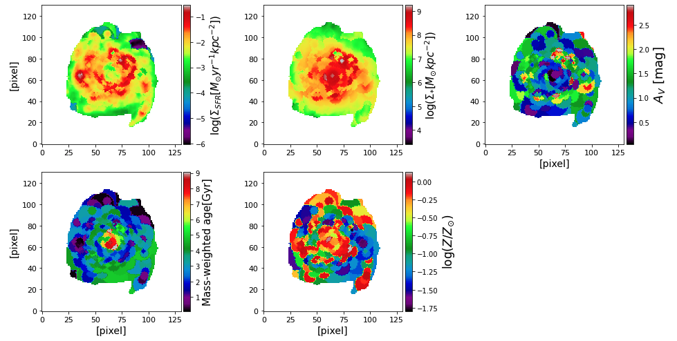

Get maps of spatially resolved properties
=========================================

Once we finished SED fitting to all spatial bins in the galaxy, we can construct maps of properties from the collection of those fitting results (in FITS files). For this, we can use :func:`piXedfit.piXedfit_fitting.maps_parameters` function in the :mod:`piXedfit_fitting` module. Please see the API reference `here <https://pixedfit.readthedocs.io/en/latest/piXedfit_fitting.html#piXedfit.piXedfit_fitting.maps_parameters>`_ for more information about this function. An example of script to get the maps properties is shown below.

	.. code-block:: python

		from piXedfit.piXedfit_fitting import maps_parameters

		fits_binmap = "pixbin_corr_specphoto_fluxmap_ngc309.fits"
		hdu = fits.open(fits_binmap)
		nbins = int(hdu[0].header['NBINSPH'])
		hdu.close()

		bin_ids = []
		name_sampler_fits = []
		for ii in range(0,nbins):
			bin_ids.append(ii)
			name = "mcmc_bin%d.fits" % (ii+1)
			name_sampler_fits.append(name)

		fits_fluxmap = "corr_specphoto_fluxmap_ngc309.fits"
		name_out_fits = "maps_properties.fits"
		maps_parameters(fits_binmap=fits_binmap, bin_ids=bin_ids, name_sampler_fits=name_sampler_fits,
				fits_fluxmap=fits_fluxmap,refband_SFR=0, refband_SM=11, name_out_fits=name_out_fits)

We can then make plots from the maps stored in the output FITS file.

	.. code-block:: python

		maps = fits.open("maps_properties.fits")
		gal_region = maps['galaxy_region'].data

		# calculate physical size of a single pixel
		from piXedfit.piXedfit_images import kpc_per_pixel

		z = float(maps[0].header['gal_z'])
		arcsec_per_pixel = 1.5                           # pixel size in arcsec
		kpc_per_pix = kpc_per_pixel(z,arcsec_per_pixel)

		rows, cols = np.where(gal_region == 0) # get pixels outside the galaxy's region of interest

		# stellar mass surface density
		map_prop_SM = np.log10(np.power(10.0,maps['pix-log_mass-p50'].data)/kpc_per_pix/kpc_per_pix)
		map_prop_SM[rows,cols] = float('nan') 

		# surface density of SFR
		map_SFR = np.log10(np.power(10.0,maps['pix-log_sfr-p50'].data)/kpc_per_pix/kpc_per_pix)
		map_SFR[rows,cols] = float('nan') 

		# Av dust attenuation
		map_Av = 1.086*maps['bin-dust2-p50'].data
		map_Av[rows,cols] = float('nan')

		# stellar metallicity
		map_logzsol  = maps['bin-logzsol-p50'].data
		map_logzsol[rows,cols] = float('nan') 

		# Mass-weighted age
		map_mw_age  = np.power(10.0,maps['bin-log_mw_age-p50'].data)
		map_mw_age[rows,cols] = float('nan') 

		# plotting
		from mpl_toolkits.axes_grid1 import make_axes_locatable

		fig1 = plt.figure(figsize=(14,7))

		###=> SFR surface density
		f1 = fig1.add_subplot(2, 3, 1)
		plt.ylabel('[pixel]', fontsize=14)
		plt.setp(f1.get_xticklabels(), fontsize=11)
		plt.setp(f1.get_yticklabels(), fontsize=11)

		plt.imshow(map_SFR, origin='lower', cmap='nipy_spectral')
		ax = plt.gca()
		divider = make_axes_locatable(ax)
		cax = divider.append_axes("right", size="5%", pad=0.05)
		cb = plt.colorbar(cax=cax)
		cb.set_label(r'log($\Sigma_{SFR}[M_{\odot}yr^{-1}kpc^{-2}]$)', fontsize=15)

		###=> stellar mass surface density
		f1 = fig1.add_subplot(2, 3, 2)
		plt.setp(f1.get_xticklabels(), fontsize=11)
		plt.setp(f1.get_yticklabels(), fontsize=11)

		plt.imshow(map_prop_SM, origin='lower', cmap='nipy_spectral')
		ax = plt.gca()
		divider = make_axes_locatable(ax)
		cax = divider.append_axes("right", size="5%", pad=0.05)
		cb = plt.colorbar(cax=cax)
		cb.set_label(r'log($\Sigma_{*}[M_{\odot}kpc^{-2}]$)', fontsize=15)

		###=> AV dust attenuation
		f1 = fig1.add_subplot(2, 3, 3)
		plt.xlabel('[pixel]', fontsize=14)
		plt.setp(f1.get_xticklabels(), fontsize=11)
		plt.setp(f1.get_yticklabels(), fontsize=11)

		plt.imshow(map_Av, origin='lower', cmap='nipy_spectral')
		ax = plt.gca()
		divider = make_axes_locatable(ax)
		cax = divider.append_axes("right", size="5%", pad=0.05)
		cb = plt.colorbar(cax=cax)
		cb.set_label(r'$A_{V}$ [mag]', fontsize=18)

		### mass-weighted age
		f1 = fig1.add_subplot(2, 3, 4)
		plt.xlabel('[pixel]', fontsize=14)
		plt.ylabel('[pixel]', fontsize=14)
		plt.setp(f1.get_xticklabels(), fontsize=11)
		plt.setp(f1.get_yticklabels(), fontsize=11)

		plt.imshow(map_mw_age, origin='lower', cmap='nipy_spectral')
		ax = plt.gca()
		divider = make_axes_locatable(ax)
		cax = divider.append_axes("right", size="5%", pad=0.05)
		cb = plt.colorbar(cax=cax)
		cb.set_label('Mass-weighted age[Gyr]', fontsize=15)

		### stellar metallicity
		f1 = fig1.add_subplot(2, 3, 5)
		plt.xlabel('[pixel]', fontsize=14)
		plt.setp(f1.get_xticklabels(), fontsize=11)
		plt.setp(f1.get_yticklabels(), fontsize=11)

		plt.imshow(map_logzsol, origin='lower', cmap='nipy_spectral')
		ax = plt.gca()
		divider = make_axes_locatable(ax)
		cax = divider.append_axes("right", size="5%", pad=0.05)
		cb = plt.colorbar(cax=cax)
		cb.set_label(r'log($Z/Z_{\odot}$)', fontsize=17)

		plt.subplots_adjust(left=0.07, right=0.95, bottom=0.1, top=0.98, hspace=0.2, wspace=0.3)
		plt.show()

We can then get a plot as shown below.

