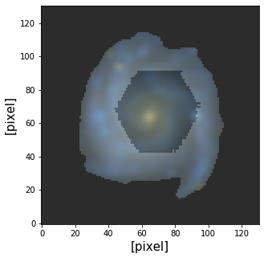
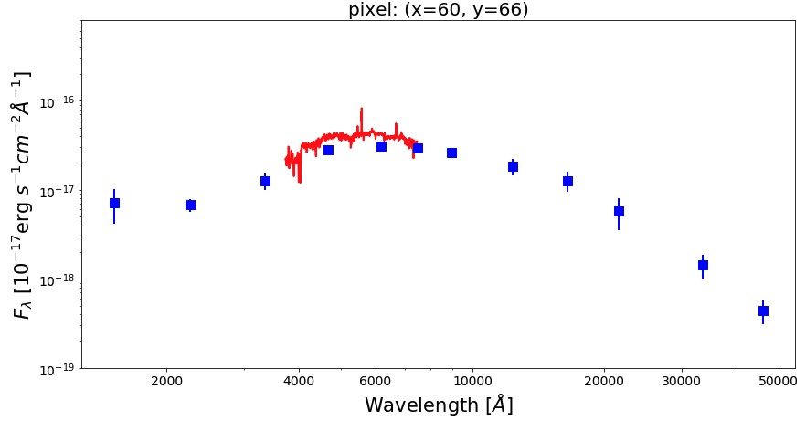
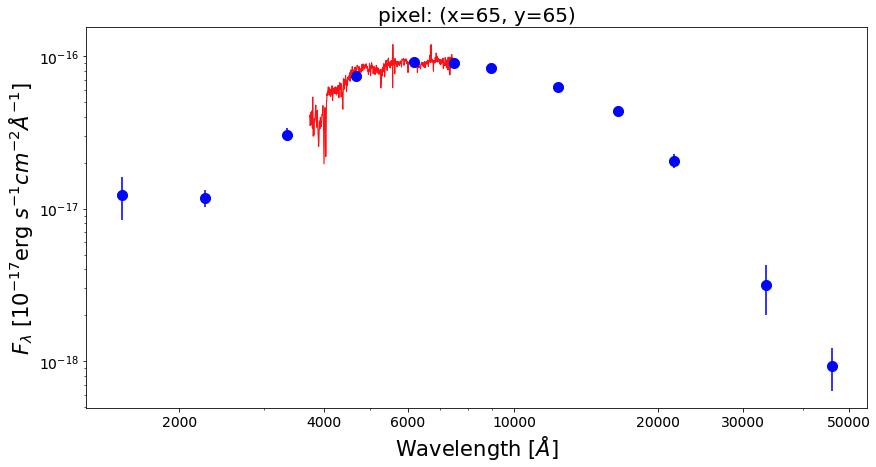
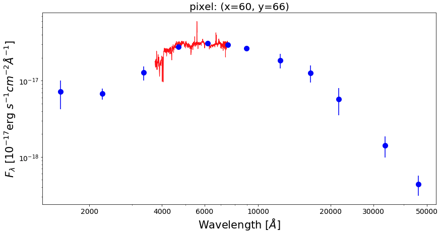
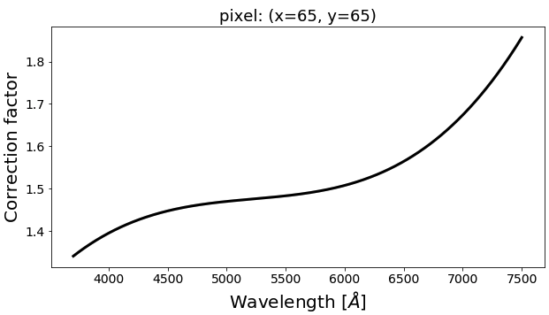
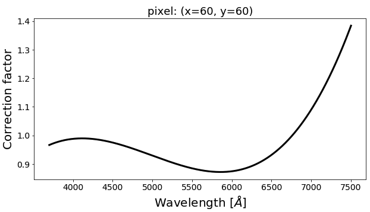

Spatial and Spectral Matching of imaging and IFS data
=====================================================

In the analysis of global (i.e., integrated) SED of galaxies, there have been several attemps at combining spectra (at rest-frame optical) and broadband photometry (over a wider wavelength range) into a so-called spectrophotometric SED. One of the great advantages from this combination is the enhancement of the constraining power in the SED fitting given by the high spectral sampling of the optical spectra and the wider wavelength coverage (e.g., FUV to NIR) of the photometric SED. This could help in breaking the existing degeneracies among parameters (especially among age, metallicity, and dust attenuation) in the SED fitting process.

The current abundance of the imaging and IFS (integral field spectroscopy) data (especially for local galaxies) open up new avenues for the analysis of the spatially resolved spectrophotometric SED of galaxies. In this light, **piXedfit** provides a **new feature** of matching (in both spatially and spectrally) between imaging and IFS data on pixel level. This kind of data would be very useful for various analyses. One of the power of this data, besides enhancing the constraining power as mentioned above, is the wider spatial coverage of the imaging compared to the IFS observation. The imaging observaitons, especially those that are deep and have high spatial resolution, could cover the extended region of galaxies with a sufficient S/N ratio, thus covering most of the optical region of the galaxies. A module in **piXedfit** featuring this task is :ref:`piXedfit_spectrophotometric <mod_specphoto>`.

In this brief tutorial, we will combine 12-band imaging data (covering FUV to NIR) and IFS data from the `CALIFA <https://califa.caha.es/>`_ survey. The imaging data are the same as we have analyzed in :ref:`image processing <img_processing>`, which are consists of imaging data from the GALEX, SDSS, 2MASS, and WISE. A more detailed tutorial can be seen at  
`FUVtoNIR_CALIFA <https://github.com/aabdurrouf/piXedfit/tree/main/examples/FUVtoNIR_CALIFA>`_. This feature is also applicable for IFS data from `MaNGA <https://www.sdss.org/surveys/manga/>`_ survey. A similar tutorial that uses this IFS data is given at `FUVtoNIR_MaNGA <https://github.com/aabdurrouf/piXedfit/tree/main/examples/FUVtoNIR_MaNGA>`_.       

Spatial matching
----------------

Overall, there are two steps for combining imaging and IFS data on pixel level. First, spatial matching, which is a matching on the spatial resolution (i.e., PSF size) and sampling (i.e., pixel size). We will do this task here. Second is a matching spectrally, in which we correct for the mismatch between the spectra and photometry along the spectral axis (i.e., wavelength or the 3rd axis). We will perform this task in the next step. 

Here we use photometric data cube (``fluxmap_ngc309.fits``) produced in the :ref:`image processing <img_processing>` and IFS data from CALIFA (``NGC0309.COMB.rscube.fits.gz``), which is downloaded from 
the `CALIFA website <https://califa.caha.es/?q=content/califa-3rd-data-release>`_. The spatial matching can be performed using :func:`piXedfit.piXedfit_spectrophotometric.match_imgifs_spatial`. This process will produce spectrophotometric data cube ``specphoto_fluxmap_ngc309.fits``.  

	.. code-block:: python

		import numpy as np
		from astropy.io import fits
		import matplotlib.pyplot as plt

		# call the function
		from piXedfit.piXedfit_spectrophotometric import match_imgifs_spatial

		photo_fluxmap = "fluxmap_ngc309.fits"			# photometric data cube
		ifs_data = "NGC0309.COMB.rscube.fits.gz"		# IFS data cube
		ifs_survey = "califa"					# IFS data source
		name_out_fits = "specphoto_fluxmap_ngc309.fits"		# name for the output file
		match_imgifs_spatial(photo_fluxmap, ifs_data, ifs_survey=ifs_survey, 
					name_out_fits=name_out_fits)

Let's check the result. First, let's extract the information from the FITS file.

	.. code-block:: python

		# open the FITS file
		cube = fits.open("specphoto_fluxmap_ngc309.fits")

		# get header
		header = cube[0].header

		# get photometry and IFS regions
		photo_region = cube['photo_region'].data
		spec_region = cube['spec_region'].data 

		# get unit of flux
		unit = float(header['unit'])	# in erg/s/cm2/A

		# get maps of photometric fluxes
		map_fluxes = cube['photo_flux'].data

		# get photometric SEDs of individual pixels
		# transpose from (band,y,x) to (y,x,band)
		pix_photo_flux = np.transpose(cube['photo_flux'].data, axes=(1,2,0))*unit
		pix_photo_flux_err = np.transpose(cube['photo_fluxerr'].data, axes=(1,2,0))*unit

		# get spectra of individual pixels
		# transpose from (wave,y,x) to (y,x,wave)
		pix_spec_flux = np.transpose(cube['spec_flux'].data, axes=(1,2,0))*unit
		pix_spec_flux_err = np.transpose(cube['spec_fluxerr'].data, axes=(1,2,0))*unit

		# get wavelength of the spectra
		spec_wave = cube['wave'].data

		cube.close()

First, we will plot the coverages of the imaging and IFS data after the matching.  

	.. code-block:: python

		from astropy.visualization import make_lupton_rgb

		g = map_fluxes[3]*10 		# SDSS/g
		r = map_fluxes[4]*10 		# SDSS/r
		i = map_fluxes[5]*10 		# SDSS/i

		rgb_default = make_lupton_rgb(i, r, g)

		fig1 = plt.figure(figsize=(5,5))
		f1 = plt.subplot()
		plt.xlabel('[pixel]', fontsize=15)
		plt.ylabel('[pixel]', fontsize=15)

		plt.imshow(rgb_default, origin='lower', alpha=1.0)
		plt.imshow(spec_region, origin='lower', cmap='Greys', alpha=0.2)

Now, we will check SED of some pixels. Before we can plot the SEDs, we need to get the list of filters and their central wavelength.

	.. code-block:: python

		# get filters from the header
		nbands = int(header['nfilters'])
		filters = []
		for bb in range(0,nbands):
			str_temp = 'fil%d' % bb
			filters.append(header[str_temp])

		# get central wavelength of filters
		from piXedfit.utils.filtering import cwave_filters
		photo_wave = cwave_filters(filters)

Below we plot SEDs of three example pixels.

	.. code-block:: python

		from matplotlib.ticker import ScalarFormatter

		pix_x = [65, 60, 60]
		pix_y = [65, 60, 66]

		nwaves = len(spec_wave)
		for ii in range(0,3):
			xx, yy = pix_x[ii], pix_y[ii]

			photo_SED = pix_photo_flux[yy][xx]
			photo_SED_err = pix_photo_flux_err[yy][xx]
			spec_SED = pix_spec_flux[yy][xx]

			fig1 = plt.figure(figsize=(14,7))
			f1 = plt.subplot()   
			plt.title("pixel: (x=%d, y=%d)" % (xx,yy), fontsize=20)
			f1.set_yscale('log')
			f1.set_xscale('log')
			plt.setp(f1.get_yticklabels(), fontsize=14)
			plt.setp(f1.get_xticklabels(), fontsize=14)
			plt.xlabel(r'Wavelength $[\AA]$', fontsize=21)
			plt.ylabel(r'$F_{\lambda}$ [$10^{-17}$erg $s^{-1}cm^{-2}\AA^{-1}$]', fontsize=21)
			xticks = [2000,4000,6000,10000,20000,30000,50000]
			plt.xticks(xticks)
			plt.ylim(1.0e-19,8e-16)
			for axis in [f1.xaxis]:
				axis.set_major_formatter(ScalarFormatter())

			# Optional: cut the spectra around the edge to exclude those commonly uncertain fluxes
			plt.plot(spec_wave[20:nwaves-20], spec_SED[20:nwaves-20], lw=2.0, color='red')
			plt.errorbar(photo_wave, photo_SED, yerr=photo_SED_err, markersize=10,
							color='blue', fmt='s', lw=2)

.. image:: img_ifs_2.png
.. image:: img_ifs_3.png

Spectral matching
-----------------
.. _spectral_matching:

As we see in the figures above, there is a missmatch between the spectra and the photometric SEDs. This discrepancy seems to be complex as it shows variations from galaxy to galaxy and the wavelength-variations nature of the discrepancy. Next, we will correct this discrepancy using :func:`piXedfit.piXedfit_spectrophotometric.match_imgifs_spectral` function. Basically, this function will perform simple SED fitting to the photometric SED of individual pixels to find a best-fit model spectrum for each pixel. A wavelength-dependent ratio (between the best-fit model spectrum and the IFS spectrum) is then fit with a third-order Legendre polynomial function to get smooth correction factor, which is then applied to correct the IFS spectra.  

This calculation is rather heavy and time-consuming, depending on the number of pixels (that have spec+photo SEDs) and the number of cores that are used (nproc) in the calculation. It's recommended to run this calculation separately (from this jupyter notebook) on a multicores computer (or cluster). The computational time can be shorten by inncreasing the number of cores.   

	.. code-block:: python

		from piXedfit.piXedfit_spectrophotometric import match_imgifs_spectral

		# spectrophotometric data cube produced in the previous step
		specphoto_file = "specphoto_fluxmap_ngc309.fits"		 
		nproc = 20 					# number of cores to be used for calculation
		name_out_fits = "corr_%s" % specphoto_file 		# name of output file

		match_imgifs_spectral(specphoto_file, nproc=nproc, name_out_fits=name_out_fits)

This process will produce spectrophotometric data cube ``corr_specphoto_fluxmap_ngc309.fits``. In the following, we will check this data cube. First, we open the FITS file and extract the data.

	.. code-block:: python

		# open the FITS file
		cube = fits.open("corr_specphoto_fluxmap_ngc309.fits")

		header = cube[0].header
		wave = cube['wave'].data
		photo_flux = cube['PHOTO_FLUX'].data
		photo_flux_err = cube['PHOTO_FLUXERR'].data
		spec_flux = cube['SPEC_FLUX'].data
		spec_flux_err = cube['SPEC_FLUXERR'].data
		# correction factors
		corr_factor = cube['corr_factor'].data

		# unit of flux
		unit = header['unit'] 	# in erg/s/cm2/A
		cube.close()

Get SEDs of individual pixels.

	.. code-block:: python

		# get photometric SEDs of pixels:
		#transpose (band,y,x) => (y,x,band):
		pix_photo_SED = np.transpose(photo_flux, axes=(1, 2, 0))*unit
		pix_photo_SED_err = np.transpose(photo_flux_err, axes=(1, 2, 0))*unit

		# get spectra:
		#transpose (wavelength,y,x) => (y,x,wavelength):
		pix_spec_SED = np.transpose(spec_flux, axes=(1, 2, 0))*unit
		pix_spec_SED_err = np.transpose(spec_flux_err, axes=(1, 2, 0))*unit

		pix_corr_factor = np.transpose(corr_factor, axes=(1, 2, 0))

Make plot of the SEDs of the same three pixels that we have shown before, but now after correction has been applied. 

	.. code-block:: python

		nwaves = len(wave)
		for ii in range(0,3):
			xx, yy = pix_x[ii], pix_y[ii]

			fig1 = plt.figure(figsize=(14,7))
			f1 = plt.subplot()   
			plt.title("pixel: (x=%d, y=%d)" % (xx,yy), fontsize=20)
			f1.set_yscale('log')
			f1.set_xscale('log')
			plt.setp(f1.get_yticklabels(), fontsize=14)
			plt.setp(f1.get_xticklabels(), fontsize=14)
			plt.xlabel(r'Wavelength $[\AA]$', fontsize=21)
			plt.ylabel(r'$F_{\lambda}$ [$10^{-17}$erg $s^{-1}cm^{-2}\AA^{-1}$]', fontsize=21)
			xticks = [2000,4000,6000,10000,20000,30000,50000]
			plt.xticks(xticks)
			plt.ylim(1.0e-19,8e-16)
			for axis in [f1.xaxis]:
				axis.set_major_formatter(ScalarFormatter())

			# Optional: cut the spectra around the edge to exclude those commonly uncertain fluxes
			plt.plot(wave[20:nwaves-20], pix_spec_SED[yy][xx][20:nwaves-20], lw=2.0, color='red')
			plt.errorbar(photo_wave, pix_photo_SED[yy][xx], yerr=pix_photo_SED_err[yy][xx], markersize=10,
							color='blue', fmt='s', lw=2)

.. image:: img_ifs_6.png

We can see the correction factors that have been applied to the spectra with the following script.

	.. code-block:: python

		for ii in range(0,3):
		xx, yy = pix_x[ii], pix_y[ii]

		fig1 = plt.figure(figsize=(14,7))
		f1 = plt.subplot()   
		plt.title("pixel: (x=%d, y=%d)" % (xx,yy), fontsize=20)
		plt.setp(f1.get_yticklabels(), fontsize=14)
		plt.setp(f1.get_xticklabels(), fontsize=14)
		plt.xlabel(r'Wavelength $[\AA]$', fontsize=21)
		plt.ylabel(r'Correction factor', fontsize=21)

		plt.plot(wave, pix_corr_factor[yy][xx], lw=3.0, color='black')

.. image:: img_ifs_10.png

