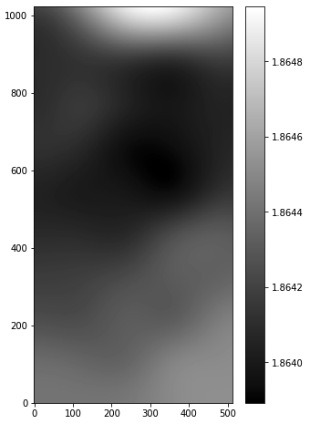
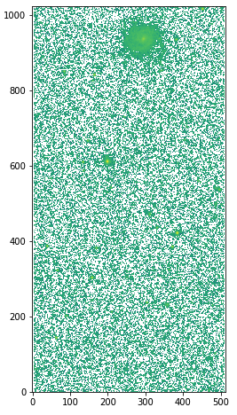
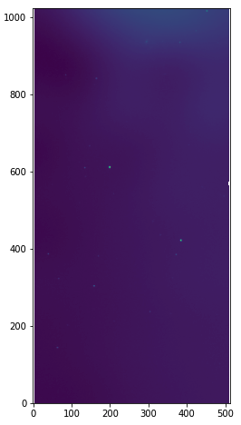
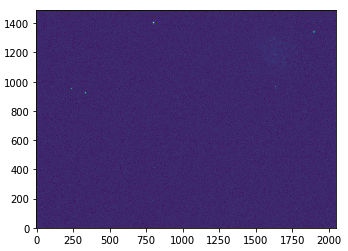
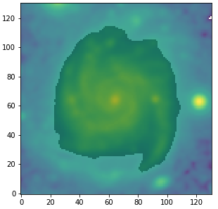

.. _img_processing:

Image processing
================

In the analysis of spatially resolved SED of galaxy, it is important to make sure that the multiwavelength images that are used are all matched to the same spatial resolution (i.e., PSF size) and sampling (i.e., pixel size), so that a given pixel represents the same region on the sky. Such an image processing can be performed using the :ref:`piXedfit_images <api_images>` module. 
This module is a python scripting module that combines various useful functions in `Astropy <https://www.astropy.org/>`_, `photutils <https://photutils.readthedocs.io/en/stable/>`_, and `reproject <https://reproject.readthedocs.io/en/stable/>`_ such that an image processing task for a combination of imaging data can be done automatically. 

Before image processing, one need to make sure that the images are all background-free (i.e., background have been subtracted from the images), which are then called as science images. If this is not the case, background subtraction can be performed using :func:`piXedfit.piXedfit_images.subtract_background` funciton, which will be described further below. After that, one need to construct variance images, which are the square of uncertainty images. For :ref:`known images <list-imagingdata>`, this task can be done using various functions in the :ref:`piXedfit_images <api_images>` module. Once science and variance images have been constructed, image processing can be performed using the :class:`piXedfit.piXedfit_images.images_processing` class. The process basically performs PSF matching and spatial resampling and reprojection to the multiwavelength images.    

Background subtraction
----------------------
Suppose we have a 2MASS/J image as shown below (downloaded from `2MASS website <https://irsa.ipac.caltech.edu/applications/2MASS/IM/interactive.html>`_), which is not background-free.   

	.. code-block:: python

		import numpy as np
		from astropy.io import fits

		# open FITS file
		hdu = fits.open("aJ_asky_001022s0620186.fits")

		# plot the image
		plt.figure(figsize=(5,10))
		plt.imshow(np.log10(hdu[0].data), origin='lower')
		hdu.close()

.. image:: img_proc_1.png

Background subtraction on this image can be performed using :func:`piXedfit.piXedfit_images.subtract_background` funciton. 
This function produces background image, RMS image, and background-subtracted science image. 

	.. code-block:: python

		from piXedfit.piXedfit_images import subtract_background

		fits_image = "aJ_asky_001022s0620186.fits"
		subtract_background(fits_image, sigma=3.0, box_size=[100,100], mask_sources=True)

``sigma`` is the threshold value for the sigma clipping, ``box_size`` is box size in image gridding, ``mask_sources`` is a flag stating whether to mask the astroomical sources (i.e., objects) within the image. If set as ``True``, source detection and segmentation will be performed using `SEP <https://sep.readthedocs.io/en/v1.0.x/index.html>`_. Please see the API reference for more detail information about this function.  

The outputs are: ``skybg_aJ_asky_001022s0620186.fits``, ``skybgrms_aJ_asky_001022s0620186.fits``, and ``skybgsub_aJ_asky_001022s0620186.fits``. Let's plot the background and science images. 

	.. code-block:: python

		# background image
		hdu = fits.open("skybg_aJ_asky_001022s0620186.fits")
		plt.figure(figsize=(5,8))
		plt.imshow(np.log10(hdu[0].data), origin='lower', cmap='gray')
		plt.colorbar()
		hdu.close()

		# background-subtracted image
		hdu = fits.open("skybgsub_aJ_asky_001022s0620186.fits")
		plt.figure(figsize=(5,8))
		plt.imshow(np.log10(hdu[0].data), origin='lower') 
		hdu.close()

Constructing variance images
----------------------------
For constructing variance (i.e., square of the uncertainty) images, there are various functions provided in **piXedfit**. Depending on the imaging data, one can choose the appropriate function. Available functions are: :func:`var_img_2MASS`, :func:`var_img_GALEX`, :func:`var_img_WISE`, and :func:`var_img_sdss` for 2MASS, GALEX, WISE, and SDSS imaging data. These functions calculate variance of the pixel values following prescriptions provided in the relevant information or literature associated with the surveys. For other imaging data, one need to construct uncertainty image or weight (i.e., inverse variance) image and then use :func:`var_img_from_unc_img` or :func:`var_img_from_weight_img` functions, which are also provided in the :ref:`piXedfit_images <api_images>` module.

In the following, we will demonstrate how to construct variance image from 2MASS and SDSS images. First, we will construct variance image of the 2MASS/J image that we have substracted the background in the previous step. 

	.. code-block:: python

		from piXedfit.piXedfit_images import var_img_2MASS

		sci_img = "skybgsub_aJ_asky_001022s0620186.fits"
		skyrms_img = "skybgrms_aJ_asky_001022s0620186.fits"
		var_img_2MASS(sci_img=sci_img, skyrms_img=skyrms_img)   

This process will produce ``var_skybgsub_aJ_asky_001022s0620186.fits``. Let's plot variance image.

	.. code-block:: python

		hdu = fits.open("var_skybgsub_aJ_asky_001022s0620186.fits")
		plt.figure(figsize=(5,8))
		plt.imshow(np.log10(hdu[0].data), origin='lower')
		hdu.close()

Now, let's try constructing variance image from SDSS image ``frame-u-001740-3-0115.fits`` (downloaded from the SDSS website).

	.. code-block:: python

		from piXedfit.piXedfit_images import var_img_sdss

		fits_image = "frame-u-001740-3-0115.fits"
		var_img_sdss(fits_image, filter_name='sdss_u')

This will produce ``var_frame-u-001740-3-0115.fits``.

	.. code-block:: python

		hdu = fits.open("var_frame-u-001740-3-0115.fits")
		plt.figure(figsize=(10,4))
		plt.imshow(np.log10(hdu[0].data), origin='lower')
		hdu.close()

Performing image processing
---------------------------

Next, we will perform image processing. In this example, we will analyze NGC 309 galaxy using 12-band imaging data from GALEX, SDSS, 2MASS, and WISE (W1 and W2). This task can be done using the :class:`piXedfit.piXedfit_images.images_processing` class. In the following, only brief overview of the steps are described. A more complete tutorials can be seen in `FUV to NIR images processing <https://github.com/aabdurrouf/piXedfit/tree/main/examples/FUVtoNIR_CALIFA>`_ or `here <https://github.com/aabdurrouf/piXedfit/tree/main/examples/FUVtoNIR_MaNGA>`_. The :class:`images_processing` class can also be used for analysis of FUV--FIR data as demonstrated in another tutorial: `FUV to FIR images processing <https://github.com/aabdurrouf/piXedfit/tree/main/examples/FUVtoFIR>`_.   

First, we have to set up the input. 

	.. code-block:: python

		# call images_processing 
		from piXedfit.piXedfit_images import images_processing

		# list the filters
		filters = ['galex_fuv', 'galex_nuv', 'sdss_u', 'sdss_g', 'sdss_r', 'sdss_i', 
			'sdss_z', '2mass_j', '2mass_h', '2mass_k', 'wise_w1', 'wise_w2']

		# input science images
		sci_img = {}
		sci_img['galex_fuv'] = 'GI1_009100_NGC0309-fd-intbgsub.fits'
		sci_img['galex_nuv'] = 'GI1_009100_NGC0309-nd-intbgsub.fits'
		sci_img['sdss_u'] = 'frame-u-001740-3-0115.fits'
		sci_img['sdss_g'] = 'frame-g-001740-3-0115.fits'
		sci_img['sdss_r'] = 'frame-r-001740-3-0115.fits'
		sci_img['sdss_i'] = 'frame-i-001740-3-0115.fits'
		sci_img['sdss_z'] = 'frame-z-001740-3-0115.fits'
		sci_img['2mass_j'] = 'skybgsub_aJ_asky_001022s0620186.fits'
		sci_img['2mass_h'] = 'skybgsub_aH_asky_001022s0620186.fits'
		sci_img['2mass_k'] = 'skybgsub_aK_asky_001022s0620186.fits'
		sci_img['wise_w1'] = 'skybgsub_0138m107_ac51-w1-int-3_ra14.177751925_dec-9.913864294_asec1000.000.fits'
		sci_img['wise_w2'] = 'skybgsub_0138m107_ac51-w2-int-3_ra14.177751925_dec-9.913864294_asec1000.000.fits'

		# input Variance images
		var_img = {}
		var_img['galex_fuv'] = 'var_GI1_009100_NGC0309-fd-intbgsub.fits'
		var_img['galex_nuv'] = 'var_GI1_009100_NGC0309-nd-intbgsub.fits'
		var_img['sdss_u'] = 'var_frame-u-001740-3-0115.fits'
		var_img['sdss_g'] = 'var_frame-g-001740-3-0115.fits'
		var_img['sdss_r'] = 'var_frame-r-001740-3-0115.fits'
		var_img['sdss_i'] = 'var_frame-i-001740-3-0115.fits'
		var_img['sdss_z'] = 'var_frame-z-001740-3-0115.fits'
		var_img['2mass_j'] = 'var_skybgsub_aJ_asky_001022s0620186.fits'
		var_img['2mass_h'] = 'var_skybgsub_aH_asky_001022s0620186.fits'
		var_img['2mass_k'] = 'var_skybgsub_aK_asky_001022s0620186.fits'
		var_img['wise_w1'] = 'var_0138m107_ac51-w1-unc-3_ra14.177751925_dec-9.913864294_asec1000.000.fits'
		var_img['wise_w2'] = 'var_0138m107_ac51-w2-unc-3_ra14.177751925_dec-9.913864294_asec1000.000.fits'

		# NGC 309 galaxy coordinate
		gal_ra = 14.177751925 			# RA
		gal_dec = -9.913864294 			# DEC

		# redshift of the galaxy
		gal_z = 0.0188977

		# size of the final stamps will be produced
		stamp_size = [131,131]

		# initiate the process
		img_process = images_processing(filters=filters,sci_img=sci_img,var_img=var_img,gal_ra=gal_ra,
							gal_dec=gal_dec, gal_z=gal_z,stamp_size=stamp_size)

In the script above, we suply list of filters (see :ref:`managing filters <manage_filters>`), science images, variance images, the coordinate of the target galaxy, the galaxy's redshift, and the desired size for the final stamp images. One should make sure that the target galaxy is present in the input images, though it is not necessary to trim the input images and make the galaxy to be placed at the center of each image. After the spatial matching, **piXedfit** would automatically locate the galaxy (based on the input coordinate) and crop the region around it when producing the final stamp images. 

Image processing is run using the following command.

	.. code-block:: python

		output_stamps = img_process.reduced_stamps()

Let's check the stamp images produced from the image processing by plotting them.

	.. code-block:: python

		fig1 = plt.figure(figsize=(20,7))

		nbands = len(filters)
		for bb in range(0,nbands):
		    f1 = fig1.add_subplot(2, 6, bb+1)
		    plt.tick_params(left = False, right = False , labelleft = False ,
		                    labelbottom = False, bottom = False)
		    str_temp = "name_img_%s" % filters[bb]
		    hdu = fits.open(output_stamps[str_temp])
		    plt.imshow(np.log10(hdu[0].data), origin='lower')
		    f1.text(0.5, 0.93, filters[bb], horizontalalignment='center', 
		            verticalalignment='center',transform = f1.transAxes, 
		            fontsize=20, color='black')
		    hdu.close()

		plt.subplots_adjust(left=0.05, right=0.95, bottom=0.05, top=0.95, hspace=0.05, wspace=0.05)

.. image:: img_proc_6.png

Next, we will define galaxy's region of interest. There are various ways to do this, including the usage of elliptical or circular aperture centered at the galaxy, and more sophesticated way using segmentation maps produced using `SEP <https://sep.readthedocs.io/en/v1.0.x/index.html>`_. In this demo, we will define the galaxy's region through the segmentation process. 

	.. code-block:: python

		segm_maps = img_process.segmentation_sep(output_stamps, thresh=2.8, minarea=100, 
					deblend_nthresh=40, deblend_cont=0.005)     

This function produces segmentation map on each band, so we get 12 maps. Then, user has a flexibility to choose whether to use single map or merge mutiple maps together for defining the galaxy's region of interest. All this option is possible with the :func:`galaxy_region` method. Suppose we choose segmentation maps from SDSS i and z bands to be merged, as shown in the following.

	.. code-block:: python

		# select segmentation maps
		select_ids = [5, 6]
		select_segm_maps = []
		for ii in select_ids:
			select_segm_maps.append(segm_maps[ii])

		gal_region = img_process.galaxy_region(select_segm_maps)  

Let's plot the defined region on top of the SDSS/g image.

	.. code-block:: python

		fig1 = plt.figure(figsize=(5,5))
		f1 = plt.subplot()
		str_temp = "name_img_%s" % filters[3]
		hdu = fits.open(output_stamps[str_temp])
		plt.imshow(np.log10(hdu[0].data), origin='lower')
		plt.imshow(gal_region, origin='lower', cmap='Greys', alpha=0.2)  
		hdu.close()

Next, we are ready to calculate fluxes (i.e., convert from the pixel values) of individual pixels within the galaxy's region of interest. This is can be done using the :func:`flux_map` method. 

	.. code-block:: python

		Gal_EBV = 0.034 						# level of attenuation by the foreground Galactic dust
		name_out_fits = "fluxmap_ngc309.fits"	# name for the output FITS file
		flux_maps = img_process.flux_map(output_stamps, gal_region, Gal_EBV=Gal_EBV, 
										name_out_fits=name_out_fits)

``Gal_EBV`` is the E(B-V) dust attenuation level due to the foreground Galactic dust. Given the coordinate of the galaxy, this information can be obtained from e.g., `NED website <https://ned.ipac.caltech.edu/forms/calculator.html>`_.

