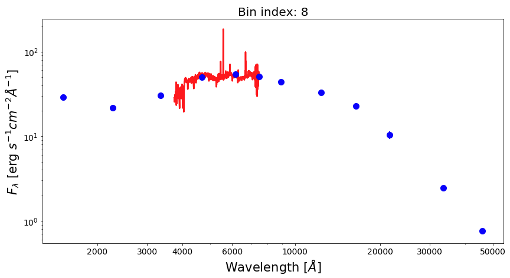
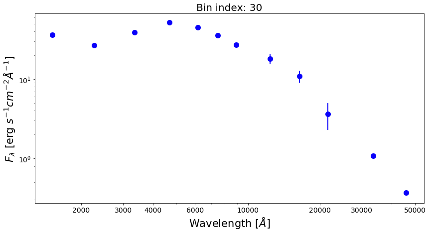

.. _pixel_binning:

Pixel binning
=============

In most cases, fluxes measured in individual pixels have a low S/N ratio. It is also common to find pixels with missing or negative fluxes. In order to gain an accurate inference of the parameters in the SED fitting, one typically needs and observed SED with sufficient S/N. For this reason, we bin SEDs of pixels before conducting further analysis, such as SED fitting. Previous studies have developed pixel binning schemes to deal with the low S/N on spatially resolved scales. However, the previous binning scheme mainly consider two factors only, which are proximity of pixels and a target S/N on a particular band that is goind to be achieved by binning the pixels. 

**piXedfit** introduces a new pixel binning scheme that incorporates a new important constraint, namely the similarity in the SED shape among pixels. This new criterion is important, especially for the spatially resolved SED fitting analyses, because it is expected to preserve any important information in the SED at the pixel level. While pixel binning is done to achieve a certain S/N threshold, at the cost of degrading the spatial resolution, we can still preserve important information in the SED at the pixel level with this binning scheme. In the previous pixel binning schemes that do not consider the similarity of the SED shape, it is possible that neighboring pixels that have different SED shapes (likely having different properties) are binned together. This could smooth out the spatial variation of the stellar population properties. 

In practice, the SED shape similarity among pixels is evaluated using the chi-square statistics. User can set a maximum value of chi-square (or a reduced chi-square, ``redc_chi2_limit``) below which a pair of SEDs are considered to be similar in shape. Besides the similarity in SED shape, the binning scheme in **piXedfit** also considers: (a) proximity (i.e., only neighboring pixels are binned together), (b) minimum diameter of a bin (``Dmin_bin``), which can be thought of as the FWHM of the PSF (although the user is free to define the diameter), and (c) S/N threshold in each band (``SNR``). The last criterion is also a new feature which allow user to get sufficient S/N across the filters, not limited to a particular filter only. 

The pixel binning task in **piXedfit** is done by :ref:`piXedfit_bin <module_bin>` module. This module provides functions for performing pixel binning on a 3D data cube (either photometric or spectrophotometric data cube) and imaging data (in single band or multiband). Below, we will demonstrate how to use these functions.  

Pixel binning on 3D data cube
-----------------------------

In this example, we will perform pixel binning to the spectrophotometric data cube (``corr_specphoto_fluxmap_ngc309.fits``) that we have produced in the previous step (i.e., :ref:`spatial and spectral matching of imaging and IFS data <match_img_ifs>`). This task can be done using :func:`piXedfit.piXedfit_bin.pixel_binning` function. This function can handle both the photometric and spectrophotometric data cubes. When the input is spectrophotometric data cube, this function will perform pixel binning to the photometric data first and then spectra of pixels are binned following the resulted binning map, so only spatial bins that fall within the IFU region will have both the photometric and spectroscopic SEDs. 

Below is an example of the lines of code for running a pixel binning. Here we want to achieve minimum S/N of 10 in 7 filters of GALEX and SDSS bands, while minimum S/N=0 for the other 5 bands. For evaluating the SED shape similarity, here we assume a maximum reduced chi-square of 4. We also set a minimum diameter of 4 pixels for the spatial bin, considering the pixel size of the data cube of 1.5'' and the PSF FWHM size of 6.37'' (~4 pixels).     

	.. code-block:: python

		import numpy as np
		from astropy.io import fits
		import matplotlib.pyplot as plt

		# call pixel binning function
		from piXedfit.piXedfit_bin import pixel_binning 

		fits_fluxmap = "corr_specphoto_fluxmap_ngc309.fits"
		ref_band = 4 			# SDSS/r as the ref. band in brightness comparison among pixels
		Dmin_bin = 4 			# in pixel
		redc_chi2_limit = 4.0

		# Set S/N thresholds.
		nbands = 12           	# number of filters in our data
		SNR = np.zeros(nbands)
		for ii in range(0,7):
			SNR[ii] = 10.0

		name_out_fits = "pixbin_%s" % fits_fluxmap
		pixel_binning(fits_fluxmap, ref_band=ref_band, Dmin_bin=Dmin_bin, SNR=SNR, 
				redc_chi2_limit=redc_chi2_limit, name_out_fits=name_out_fits)

The output of this process is ``pixbin_corr_specphoto_fluxmap_ngc309.fits``. Now, we will extract information from the FITS file and see the map of spatial bins and the SEDs of individual bins. 

	.. code-block:: python

		hdu = fits.open("pixbin_corr_specphoto_fluxmap_ngc309.fits")
		header = hdu[0].header

		# get number bins that have photometric and spectrophotometric data
		nbins_photo = int(header['nbinsph'])
		nbins_spec = int(header['nbinssp'])

		# get set of filters
		nbands = int(header['nfilters'])
		filters = []
		for bb in range(0,nbands):
			str_temp = 'fil%d' % bb
			filters.append(header[str_temp])

		# get central wavelength of filters
		from piXedfit.utils.filtering import cwave_filters
		photo_wave = cwave_filters(filters)

		# spatial bin maps
		binmap_photo = hdu['photo_bin_map'].data
		binmap_spec = hdu['spec_bin_map'].data

		# unit of flux
		unit = float(header['unit']) 			# in erg/s/cm2/A

		# wavelength of the spectra
		spec_wave = hdu['spec_wave'].data
		nwaves = len(spec_wave)

		# allocate arrays for photometric and spectrophotometric SEDs of spatial bins
		bin_photo_flux = np.zeros((nbins_photo,nbands))
		bin_photo_flux_err = np.zeros((nbins_photo,nbands))

		bin_spec_flux = np.zeros((nbins_photo,nwaves))
		bin_spec_flux_err = np.zeros((nbins_photo,nwaves))

		for bb in range(0,nbins_photo):
			bin_id = bb + 1

			rows, cols = np.where(binmap_photo==bin_id)
			bin_photo_flux[bb] = hdu['bin_photo_flux'].data[:,rows[0],cols[0]]
			bin_photo_flux_err[bb] = hdu['bin_photo_fluxerr'].data[:,rows[0],cols[0]]

			rows, cols = np.where(binmap_spec==bin_id)
			if len(rows)>0:
				bin_spec_flux[bb] = hdu['bin_spec_flux'].data[:,rows[0],cols[0]]
				bin_spec_flux_err[bb] = hdu['bin_spec_fluxerr'].data[:,rows[0],cols[0]]

		hdu.close()

Then we can plot the map of spatial bins in the following way. First, let's plot the map of bins that have photometric data only.
	
	.. code-block:: python

		from mpl_toolkits.axes_grid1 import make_axes_locatable

		fig1 = plt.figure(figsize=(7,7))
		f1 = plt.subplot()
		plt.xlabel("[pixel]", fontsize=18)
		plt.ylabel("[pixel]", fontsize=18)

		im = plt.imshow(binmap_photo, origin='lower', cmap='nipy_spectral_r', vmin=0, vmax=nbins_photo)

		divider = make_axes_locatable(f1)
		cax2 = divider.append_axes("top", size="7%", pad="2%")
		cb = fig1.colorbar(im, cax=cax2, orientation="horizontal")
		cax2.xaxis.set_ticks_position("top")
		cax2.xaxis.set_label_position("top")
		cb.ax.tick_params(labelsize=13)
		cb.set_label('Bin Index', fontsize=17)

.. image:: pixbin_1.png

Then the map of spatial bins that have spectrophotometric data can be plot in the following way.

	.. code-block:: python

		# get spec region
		hdu = fits.open("corr_specphoto_fluxmap_ngc309.fits")
		spec_region = hdu['spec_region'].data
		hdu.close()

		# plot spatial bin map
		fig1 = plt.figure(figsize=(7,7))
		f1 = plt.subplot()
		plt.xlabel("[pixel]", fontsize=18)
		plt.ylabel("[pixel]", fontsize=18)

		im = plt.imshow(binmap_spec, origin='lower', cmap='nipy_spectral_r', vmin=0, vmax=nbins_photo)
		plt.imshow(spec_region, origin='lower', cmap='Greys', alpha=0.2)

		divider = make_axes_locatable(f1)
		cax2 = divider.append_axes("top", size="7%", pad="2%")
		cb = fig1.colorbar(im, cax=cax2, orientation="horizontal")
		cax2.xaxis.set_ticks_position("top")
		cax2.xaxis.set_label_position("top")
		cb.ax.tick_params(labelsize=13)
		cb.set_label('Bin Index', fontsize=17)

.. image:: pixbin_2.png

Now, let's plot SEDs of four examples of spatial bins, three with spectrophotometric data and one with photometric only data.

	.. code-block:: python

		from matplotlib.ticker import ScalarFormatter

		bin_ids = [1, 3, 8, 30]
		for ii in range(0,len(bin_ids)):

			fig1 = plt.figure(figsize=(14,7))
			f1 = plt.subplot()   
			plt.title("Bin index: %d" % bin_ids[ii], fontsize=20)
			f1.set_yscale('log')
			f1.set_xscale('log')
			plt.setp(f1.get_yticklabels(), fontsize=14)
			plt.setp(f1.get_xticklabels(), fontsize=14)
			plt.xlabel(r'Wavelength $[\AA]$', fontsize=21)
			plt.ylabel(r'$F_{\lambda}$ [erg $s^{-1}cm^{-2}\AA^{-1}$]', fontsize=21)
			xticks = [2000,3000,4000,6000,10000,20000,30000,50000]
			plt.xticks(xticks)
			for axis in [f1.xaxis]:
				axis.set_major_formatter(ScalarFormatter())
			if np.sum(bin_spec_flux[int(bin_ids[ii])-1])>0:
				plt.plot(spec_wave[20:nwaves-20], bin_spec_flux[int(bin_ids[ii])-1][20:nwaves-20], 
						lw=2.5, color='red')

			plt.errorbar(photo_wave, bin_photo_flux[int(bin_ids[ii])-1], 
					yerr=bin_photo_flux_err[int(bin_ids[ii])-1], markersize=10,
					color='blue', fmt='o', lw=2)

.. image:: pixbin_3.png
.. image:: pixbin_4.png

Pixel binning on images
-----------------------

(This section is still under construction...)

