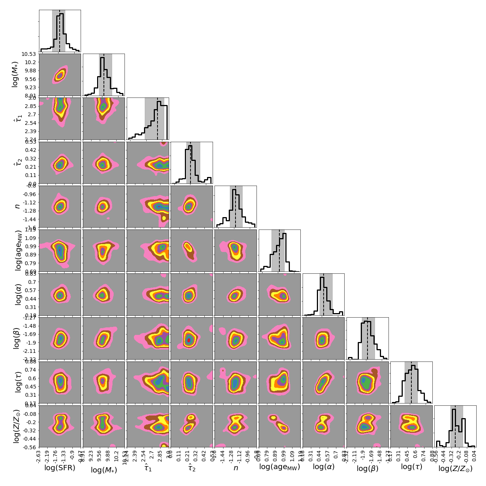
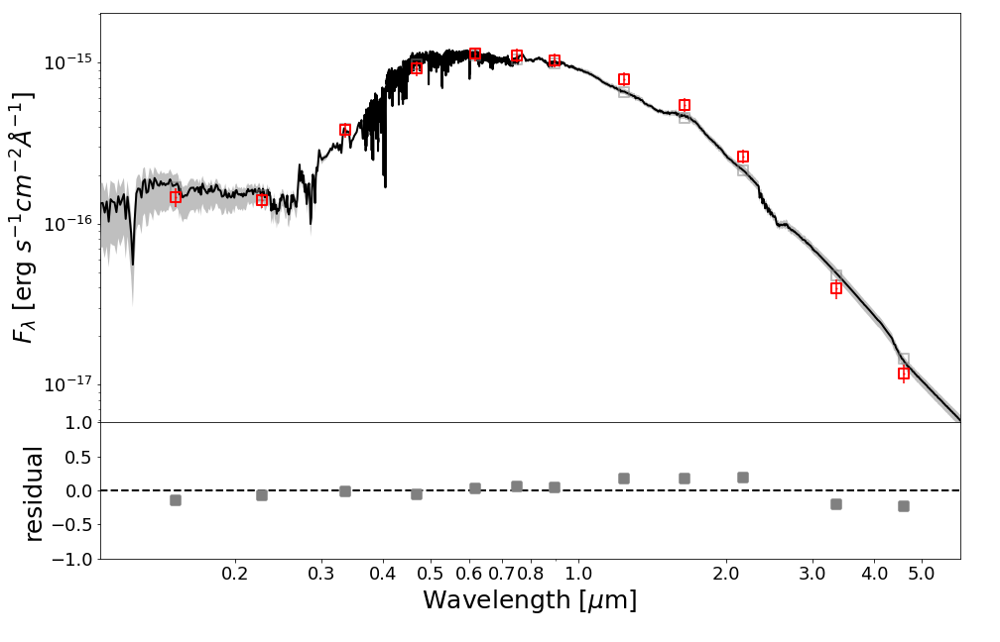
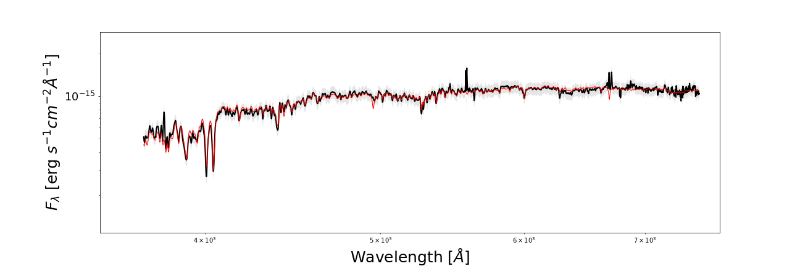
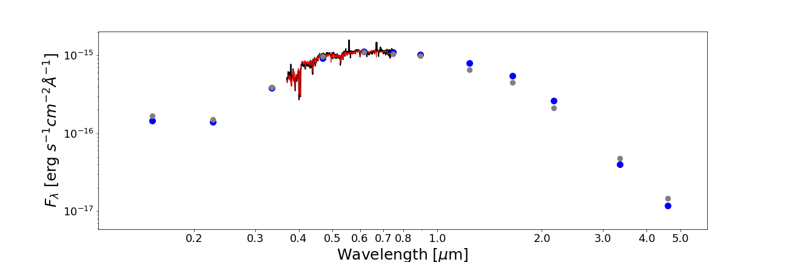
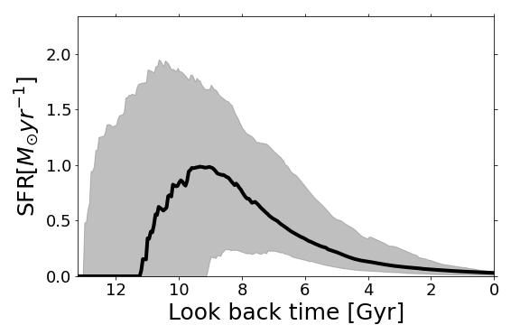

Analyzing fitting results
=========================

To check SED fitting results, piXedfit provides functions in :mod:`piXedfit_analysis` module for making visualization plots. There are three kinds of plots that can be made using this module.

* **Corner plot**, which shows joint posterior distributions of the parameters. This plot can be made using :func:`piXedfit.piXedfit_analysis.plot_corner`
* **SED plot**, which shows best-fit model SED. This plot can be made using :func:`piXedfit.piXedfit_analysis.plot_SED` function.
* **Star formation history (SFH) plot**, which shows reconstructed SFH. This plot can be made using :func:`piXedfit.piXedfit_analysis.plot_sfh_mcmc`. This plot can only be made for result of MCMC fitting with the current version of piXedfit. 

Please see the API references for more information about those functions. Below, we will demonstrate how to produce such plots for an example of fitting result to a spectrophotometric SED.

Corner plot
-----------

	.. code-block:: python

		from piXedfit.piXedfit_analysis import plot_corner

		params=['log_sfr', 'log_mass', 'dust1', 'dust2', 'dust_index', 'log_mw_age', 
			'log_alpha', 'log_beta', 'log_tau', 'logzsol']
		label_params={'dust1': '$\\hat \\tau_{1}$', 'dust2': '$\\hat \\tau_{2}$', 
			'dust_index': '$n$', 'log_alpha': 'log($\\alpha$)', 'log_beta': 'log($\\beta$)', 
			'log_mass': 'log($M_{*}$)', 'log_mw_age': 'log($\\mathrm{age}_{\\mathrm{MW}}$)',
			'log_sfr': 'log(SFR)', 'log_t0': 'log($t_{0}$)', 'log_tau': 'log($\\tau$)',
			'logzsol': 'log($Z/Z_{\\odot}$)'}

		name_sampler_fits = "mcmc_bin1.fits"
		plot_corner(name_sampler_fits, params=params, label_params=label_params)

We will get a corner plot as shown below.

SED plot
--------

	.. code-block:: python

		from piXedfit.piXedfit_analysis import plot_SED

		name_sampler_fits = "mcmc_bin1.fits"
		plot_SED(name_sampler_fits, decompose=0, 
			xticks=[0.2,0.3,0.4,0.5,0.6,0.7,0.8,1.0,2.0,3.0,4.0,5.0])

We will get SED plot as shon below.

SFH plot
--------

	.. code-block:: python

		from piXedfit.piXedfit_analysis import plot_sfh_mcmc

		name_sampler_fits = "mcmc_bin1.fits"
		plot_sfh_mcmc(name_sampler_fits)
		plt.show()

We will get SFH plot as shown below.

